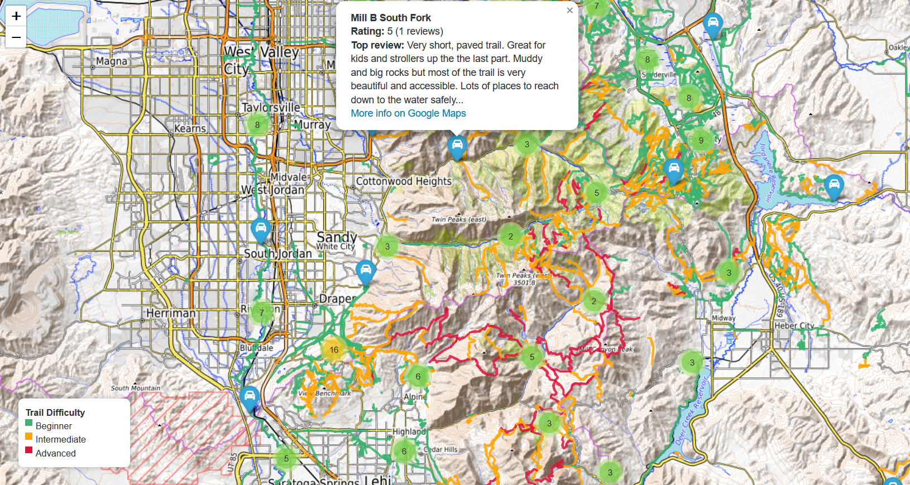

# Utah Trails Map Project

Interactive map showing hiking trails in the Wasatch Front, Utah.

## Features
- Trails colored by difficulty (Beginner / Intermediate / Advanced)
- Trailheads with Google ratings, top review, and link to Google Maps
- Interactive tooltip for trail details
- Marker clustering for dense areas

## Technologies
- Python
- GeoPandas
- Folium
- Google Maps API

## Setup
1. Clone the repo
2. Install dependencies:
